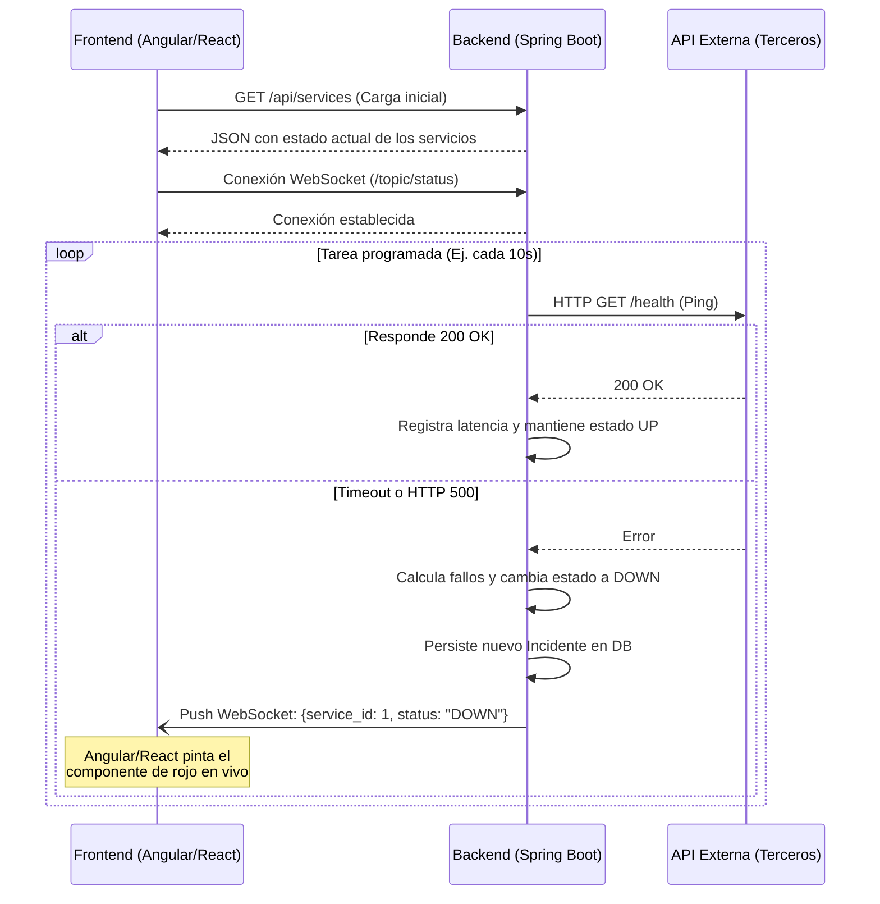

# Arquitectura del Sistema

Este documento describe cómo está estructurado **DeployOps** a nivel de código y componentes, detallando las responsabilidades de cada capa y el flujo de comunicación entre el frontend y el backend.

---

## 1. Capas del Backend (Spring Boot)

El código Java está dividido estrictamente en capas para separar las responsabilidades:

1.  **Controllers (Controladores):** Son la puerta de entrada. Exponen los endpoints REST, reciben los JSON del frontend y validan que los datos no vengan vacíos. No contienen lógica de negocio.
2.  **Services (Servicios):** El corazón de la aplicación. Aquí vive la máquina de estados, el motor de reglas para decidir cuándo abrir un incidente, y el Scheduler (las tareas programadas que se ejecutan cada *X* segundos).
3.  **Repositories (Repositorios):** Interfaces de Spring Data JPA que se encargan exclusivamente de hablar con PostgreSQL y ejecutar las sentencias SQL.

---

## 2. Flujo Asíncrono: WebSockets

Para lograr la experiencia de "tiempo real" sin sobrecargar el servidor, implementamos este flujo exacto:

1.  El Frontend carga la página y pide los datos iniciales por HTTP REST tradicional.
2.  Inmediatamente después, el Frontend abre un "tubo de comunicación" (WebSocket) con el Backend y se queda escuchando pasivamente.
3.  Cuando el *Scheduler* del Backend detecta que una API externa se cayó, cambia el estado en la base de datos y "empuja" (Push) un mensaje JSON por el tubo hacia el Frontend.
4.  El Frontend recibe el mensaje y pinta la tarjeta de color rojo al instante, sin recargar la página.

**Diagrama de Secuencia del Flujo de Monitoreo:**

