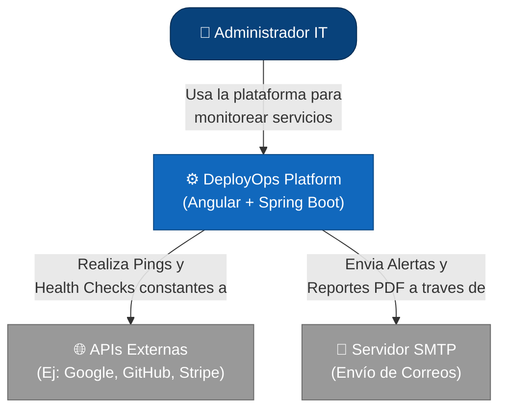
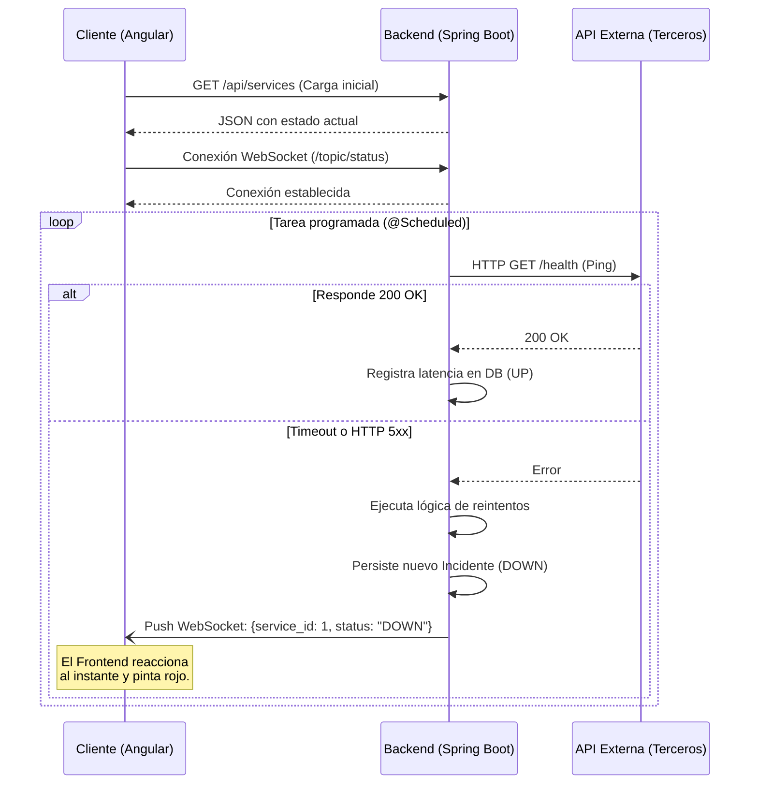

# Arquitectura del Sistema

Este documento describe cómo está estructurado **DeployOps** a nivel de código y componentes, detallando las responsabilidades de cada capa, el flujo de comunicación multiplataforma y la generación asíncrona de reportes.

---

## 1. C4 Model - Contexto del Sistema

El siguiente diagrama ilustra cómo los distintos actores e interfaces interactúan con el núcleo del sistema.

---

## 2. Capas del Backend (Spring Boot)

El código Java está dividido estrictamente en capas para separar responsabilidades y facilitar las pruebas unitarias:

1.  **Controllers (Controladores):** Son la puerta de entrada HTTP. Exponen los endpoints REST, deserializan el JSON y delegan el trabajo. No contienen reglas de negocio.
2.  **Services (Servicios):** El corazón de la aplicación. Aquí vive la máquina de estados, el generador de reportes PDF (JasperReports), y las tareas programadas (Scheduler).
3.  **Repositories (Repositorios):** Interfaces de Spring Data JPA que se encargan exclusivamente de comunicarse con PostgreSQL mediante consultas JPQL y nativas.

---

## 3. Flujo Asíncrono de Monitoreo (WebSockets)

Para lograr una experiencia reactiva de "tiempo real" sin sobrecargar el servidor (evitando el polling constante), el sistema utiliza este flujo:

1.  El Frontend carga los datos iniciales vía REST.
2.  Inmediatamente abre una conexión persistente **WebSocket** y se suscribe al canal de eventos.
3.  Cuando el *Scheduler* del Backend detecta una falla en un servicio externo, cambia el estado en la base de datos y hace un "Push" de un mensaje JSON hacia todos los clientes conectados.
4.  El Frontend (Web o Móvil) procesa el evento y actualiza la pantalla al instante.

**Diagrama de Secuencia del Health Check:**

