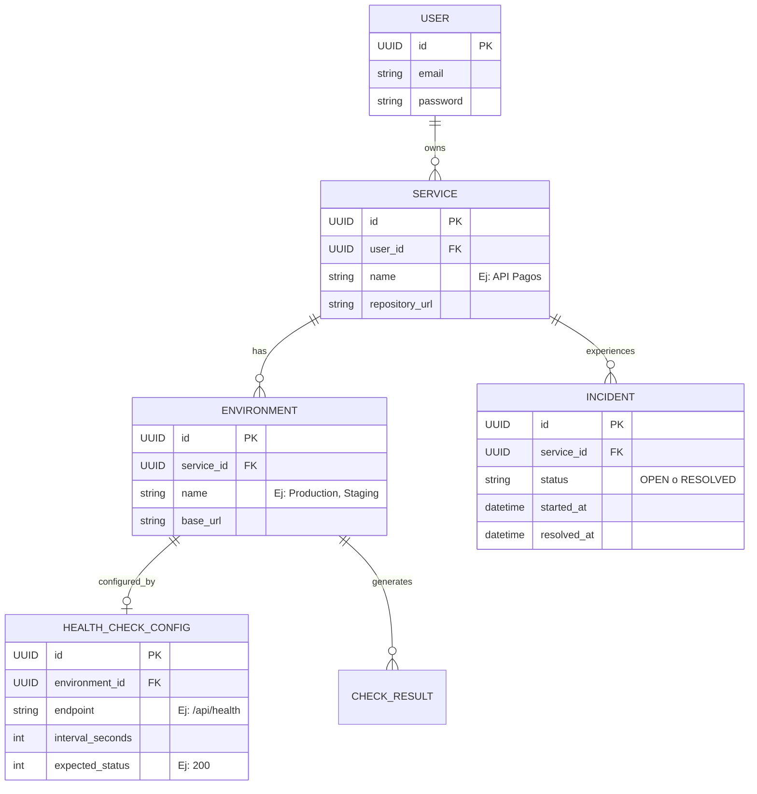
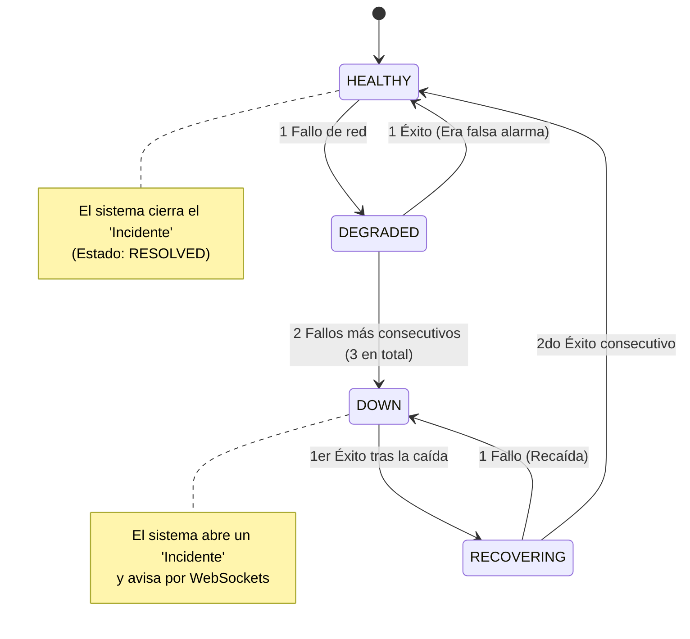

# Dominio y Reglas de Negocio

Este documento detalla la estructura lógica de los datos y las reglas exactas que dictan cómo se comporta la aplicación frente a los distintos escenarios. Define el núcleo funcional de **DeployOps**.

---

## 1. Esquema de Base de Datos (ERD)

La información se estructura de manera relacional para mantener un historial preciso de incidentes y servicios de forma aislada por usuario.

---

## 2. Máquina de Estados del Monitoreo

El sistema no genera incidentes al primer fallo de red para evitar los "falsos positivos" o parpadeos temporales. Sigue un flujo riguroso de confirmación.

---

## 3. Reglas Críticas del Sistema

### 3.1. Confirmación de Caídas (Tolerancia a fallos)
*   **Regla:** Un solo *timeout* o error HTTP 500 no marca el servicio como `DOWN`.
*   **Comportamiento:** Pasa a un estado de alerta (`DEGRADED`). Solo si el fallo persiste durante 3 ciclos de comprobación consecutivos, el servicio se considera caído oficialmente y se abre un incidente.

### 3.2. Cierre de Incidentes
*   **Regla:** Un incidente en estado `OPEN` solo puede pasar a `RESOLVED` si el sistema comprueba la estabilidad del servicio.
*   **Comportamiento:** Requiere 2 respuestas `HTTP 200 OK` consecutivas para confirmar que el servicio levantó y no fue solo un reinicio intermitente.

### 3.3. Aislamiento por Usuario (Multi-tenancy básico)
*   **Regla:** Un usuario no puede ver ni modificar los servicios de otro.
*   **Comportamiento:** Todas las consultas SQL que extraen datos deben ir filtradas por el `user_id` del token JWT actual del usuario que hizo la petición. La única excepción son los servicios marcados explícitamente como globales para la *landing page* pública.
